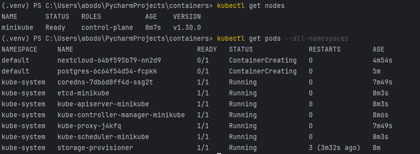
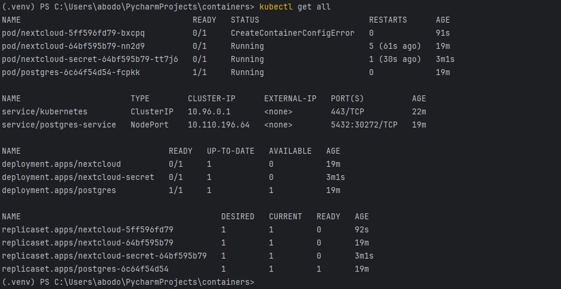
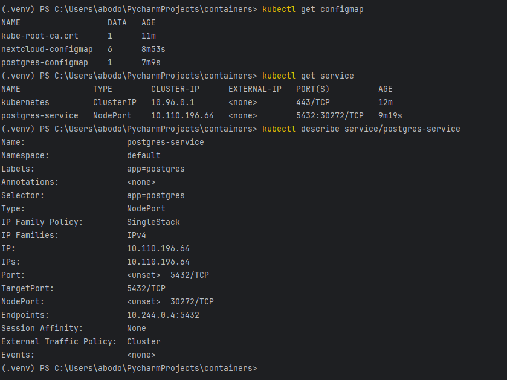
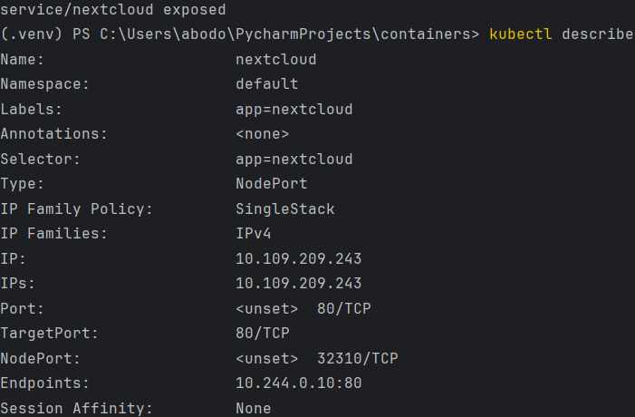
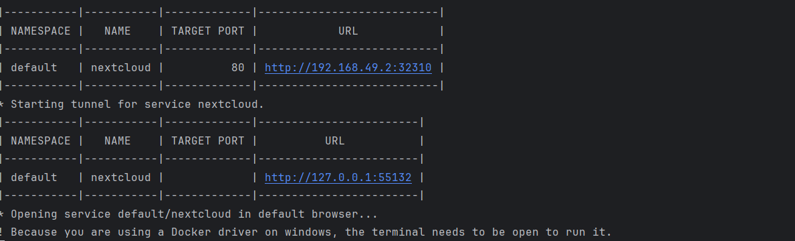
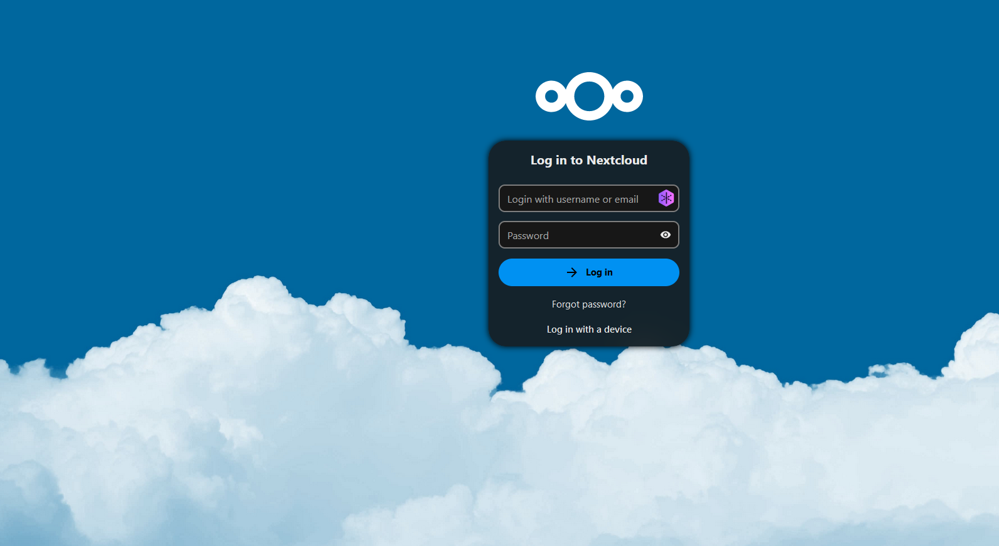
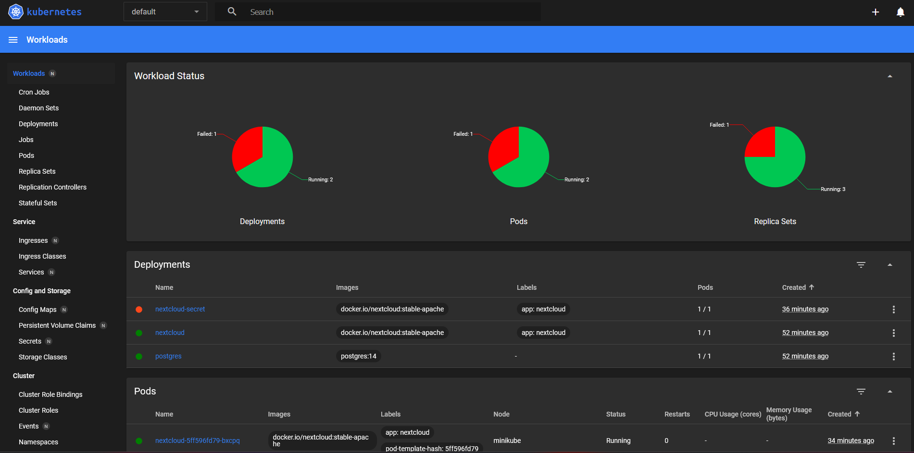

# Lab3: Установка Nextcloud с использованием Kubernetes

Этот репозиторий содержит манифесты Kubernetes для установки Nextcloud с использованием базы данных PostgreSQL.

## Ход работы

1. для хранения пароля администратора Nextcloud:

   ```bash
   kubectl apply -f nextcloud_secret.yaml
   ```

2. для хранения переменных среды Nextcloud:

   ```bash
   kubectl apply -f nextcloud_configmap.yaml
   ```

3. ConfigMap для базы данных PostgreSQL:

   ```bash
   kubectl apply -f postgres_configmap.yaml
   ```

4. PostgreSQL:

   ```bash
   kubectl apply -f postgres_deployment.yaml
   ```

5. Nextcloud:

   ```bash
   kubectl apply -f nextcloud_deployment.yaml
   ```

6. состояние развертывания:

   ```bash
   kubectl get pods
   ```

7. Дождитесь, пока все поды станут в состояние Running.

## Скриншоты

Вот несколько скриншотов интерфейса Nextcloud:

### `kubectl get`
   - 
   - 

### `kubectl describe`
   - 


### `kubectl logs`
   - 


### Nextcloud


   - 


   - 


   - 


В данном README.md предполагается, что у вас есть папка `screenshots`, где находятся изображения скриншотов.
3. **Скриншоты**

### Пример структуры репозитория

```
containers/
├── docs/
├── pg_configmap.yml
├── answers.md
├── pg_secret.yml
├── pg_service.yml
├── pg_deployment.yml
├── nextcloud_configmap.yml
├── nextcloud_secret.yml
├── nextcloud.yml
└── README.md
```
