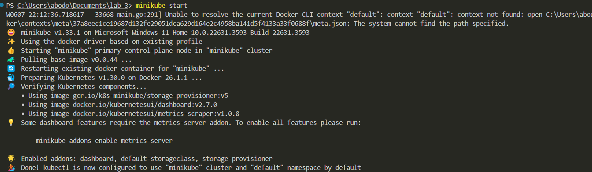
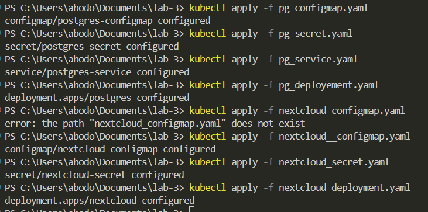
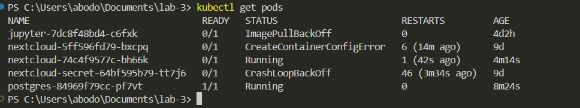

# Лаборатория З - Nextcloud
---
Этот репозиторий содержит манифесты Kubernetes для установки Nextcloud с использованием базы данных PostgreSQL.

```
kubectl apply -f pg_configmap.yaml
kubectl apply -f pg_secret.yaml
kubectl apply -f pg_service.yaml
kubectl apply -f pg_deployement.yaml

kubectl apply -f nextcloud__configmap.yaml
kubectl apply -f nextcloud_secret.yaml
kubectl apply -f nextcloud_deployment.yaml
```


## Ход работы
---
- minikube start


- kubectl apply -f



- kubectl get pods




# ОТВЕТЫ

1. Важен ли порядок выполнения этих манифестов? Почему?
Да, порядок выполнения манифестов может быть важен. Вот почему:

Да, порядок выполнения манифестов в развертываниях Kubernetes очень важен для успешного внедрения. Вот объяснение почему:

* **Цепочка зависимостей:** Многие развертывания полагаются на конфигурации (такие как Configuration Manager, Secrets) для правильной работы. Если развертывание будет расширено ссылкой на несуществующую конфигурацию ConfigMap, это завершится неудачей, так как развертывание не будет содержать требуемых сведений о конфигурации. Создав сначала конфигурацию, мы гарантируем, что она будет доступна до того, как развертывание попытается ее использовать.
* **Плавные обновления:** Kubernetes часто выполняет обновления с заменой, развертывая более новые pod'ы, одновременно аккуратно завершая работу более старых. Если конфигурации еще не присутствуют, новые pod'ы могут работать не так, как ожидалось, во время процесса обновления.

2. Что произойдет, если отскейлить количество реплик postgres-deployment в 0, затем обратно в 1, после чего попробовать снова зайти на Nextcloud?

Масштабирование реплик развертывания Postgres в Kubernetes до 0 приводит к существенным последствиям:

* **Простои базы данных:** При нулевом количестве реплик Kubernetes завершает работу всех запущенных pod'ов, связанных с развертыванием. По сути, это приводит к остановке службы базы данных Postgres, делая ее недоступной для любых приложений или служб, которые на нее полагаются.
* **Влияние на Nextcloud:** Поскольку Nextcloud, скорее всего, зависит от базы данных Postgres для пользовательских данных и логики приложения, потеря доступа приведет к ошибкам подключения. Это может проявляться как ошибка внутреннего сервера 500 в интерфейсе Nextcloud.
* **Восстановление базы данных:** Масштабирование обратно до 1 реплики запускает новый pod Postgres. Этот pod запускает службу Postgres и пытается восстановить данные из постоянного хранилища (если оно настроено). Однако, если данные не были сохранены перед масштабированием вниз, они будут потеряны.

**Последствия для Nextcloud:**

* **Потеря данных:** Без решения для постоянного хранения масштабирование до нуля и обратно приводит к потере данных. Это может привести к таким проблемам, как нарушение авторизации пользователей или отсутствие данных приложения.
* **Переинициализация:** Nextcloud может потребоваться переинициализация для правильной работы после потери соединения с базой данных и потенциально данных.
