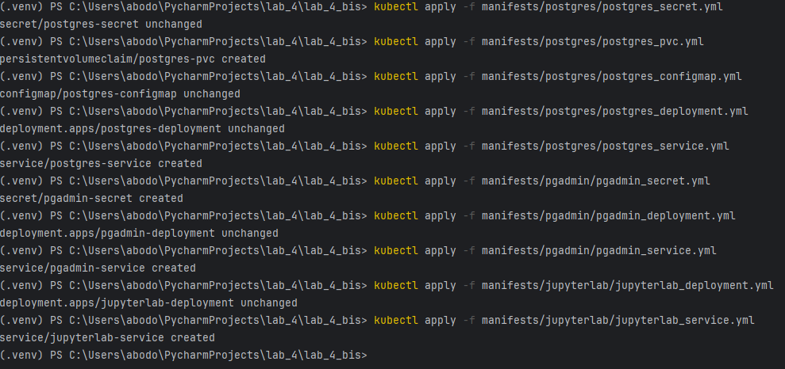
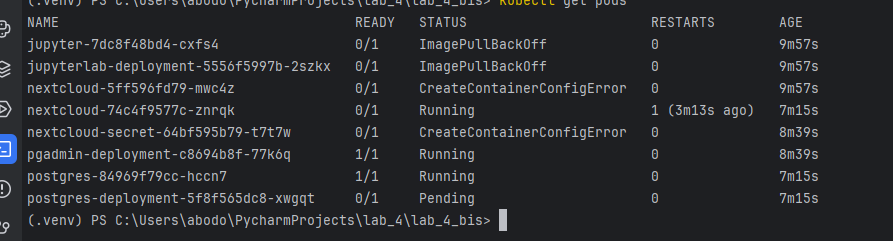
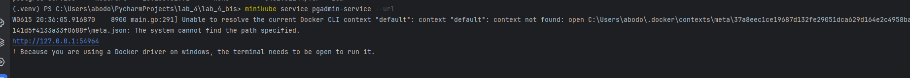
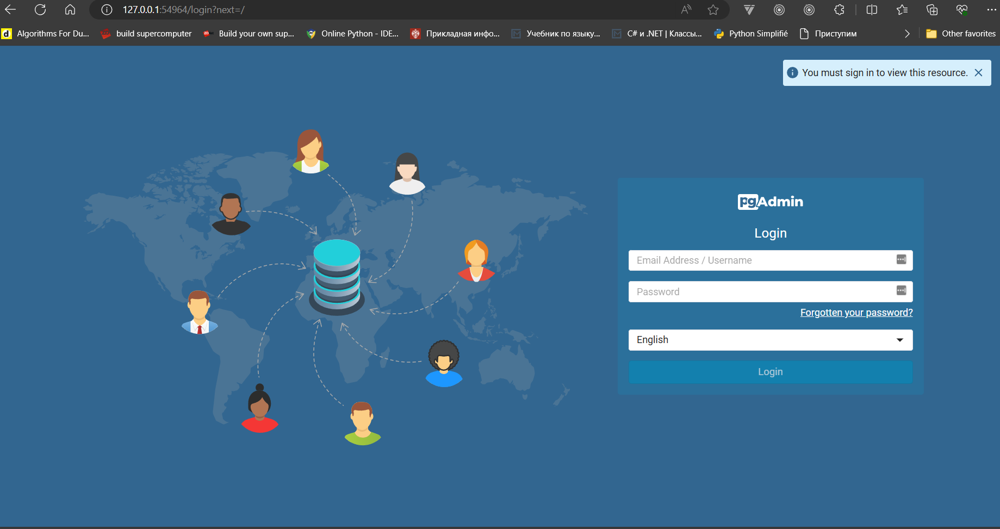
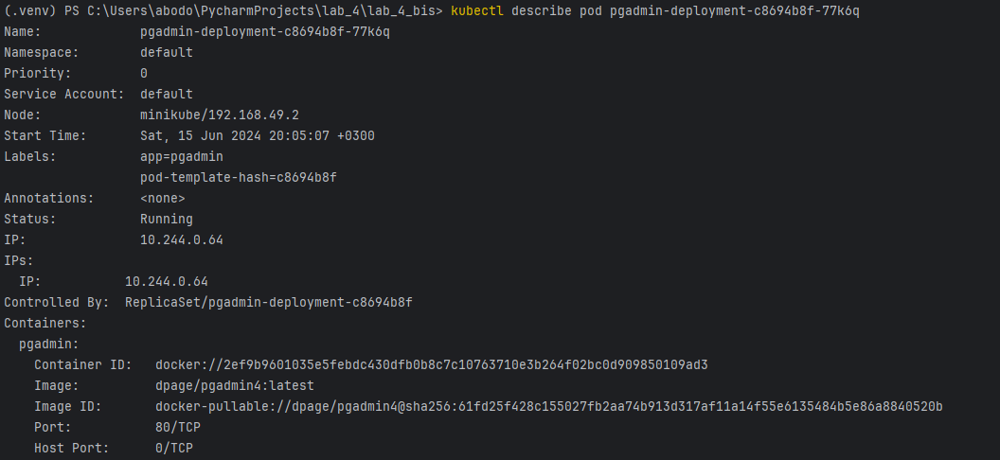

<h1>Этот проект представляет собой набор манифестов для развертывания сервисов в Kubernetes с использованием различных компонентов: `PostgreSQL`, `pgAdmin` и `JupyterLab`.</h1>

## Структура каталогов

```
.
├── manifests
│   ├── postgres
│   │   ├── postgres_secret.yml
│   │   ├── postgres_configmap.yml
│   │   ├── postgres_pvc.yml
│   │   ├── postgres_deployment.yml
│   │   └── postgres_service.yml
│   ├── pgadmin
│   │   ├── pgadmin_secret.yml
│   │   ├── pgadmin_deployment.yml
│   │   └── pgadmin_service.yml
│   ├── jupyterlab
│   │   ├── jupyterlab_deployment.yml
│   │   └── jupyterlab_service.yml
└── README.md
└── .env
```

### Манифесты PostgreSQL

**`postgres-pvc.yml`**

```yaml
apiVersion: v1
kind: PersistentVolumeClaim
metadata:
  name: postgres-pvc
spec:
  accessModes:
    - ReadWriteOnce
  resources:
    requests:
      storage: 20Gi
```

## Структура проекта

- `manifests/`: Директория с YAML манифестами для каждого сервиса.
  - `postgres/`: Манифесты для PostgreSQL.
    - `postgres_secret.yml`: Secret для хранения пароля PostgreSQL.
    - `postgres_configmap.yml`: ConfigMap для конфигурации PostgreSQL.
    - `postgres_pvc.yml`: PersistentVolumeClaim для хранения данных PostgreSQL.
    - `postgres_deployment.yml`: Deployment для развертывания контейнера PostgreSQL.
    - `postgres_service.yml`: Service для доступа к PostgreSQL.
  - `pgadmin/`: Манифесты для pgAdmin.
    - `pgadmin_secret.yml`: Secret для хранения учетных данных pgAdmin.
    - `pgadmin_deployment.yml`: Deployment для развертывания контейнера pgAdmin.
    - `pgadmin_service.yml`: Service для доступа к pgAdmin.
  - `jupyterlab/`: Манифесты для JupyterLab.
    - `jupyterlab_deployment.yml`: Deployment для развертывания контейнера JupyterLab.
    - `jupyterlab_service.yml`: Service для доступа к JupyterLab.
- `README.md`: Описание проекта, инструкции по развертыванию и скриншоты.

## Манифесты

### PostgreSQL

#### `postgres_secret.yml`

Secret для хранения пароля PostgreSQL.

#### `postgres_configmap.yml`

ConfigMap для конфигурации PostgreSQL.

#### `postgres_pvc.yml`

PersistentVolumeClaim для хранения данных PostgreSQL.

```yaml
apiVersion: v1
kind: PersistentVolumeClaim
metadata:
  name: postgres-pvc
spec:
  accessModes:
    - ReadWriteOnce
  resources:
    requests:
      storage: 10Gi
```

#### `postgres_deployment.yml`

Deployment для развертывания контейнера PostgreSQL.

#### `postgres_service.yml`

Service для доступа к PostgreSQL.

### pgAdmin

#### `pgadmin_secret.yml`

Secret для хранения учетных данных pgAdmin.

#### `pgadmin_deployment.yml`

Deployment для развертывания контейнера pgAdmin.

#### `pgadmin_service.yml`

Service для доступа к pgAdmin.

### JupyterLab

#### `jupyterlab_deployment.yml`

Deployment для развертывания контейнера JupyterLab.

#### `jupyterlab_service.yml`

Service для доступа к JupyterLab.

### Manifests


   ```bash
   kubectl apply -f manifests/postgres/postgres_secret.yml
   kubectl apply -f manifests/postgres/postgres_configmap.yml
   kubectl apply -f manifests/postgres/postgres_pvc.yml
   kubectl apply -f manifests/postgres/postgres_deployment.yml
   kubectl apply -f manifests/postgres/postgres_service.yml
   
   kubectl apply -f manifests/pgadmin/pgadmin_secret.yml
   kubectl apply -f manifests/pgadmin/pgadmin_deployment.yml
   kubectl apply -f manifests/pgadmin/pgadmin_service.yml
   
   kubectl apply -f manifests/jupyterlab/jupyterlab_deployment.yml
   kubectl apply -f manifests/jupyterlab/jupyterlab_service.yml
   ```
---



---
команды `kubectl get pods`



 
## Скриншоты

  - Проверка Service
---



---

  - Проверка Deployement


