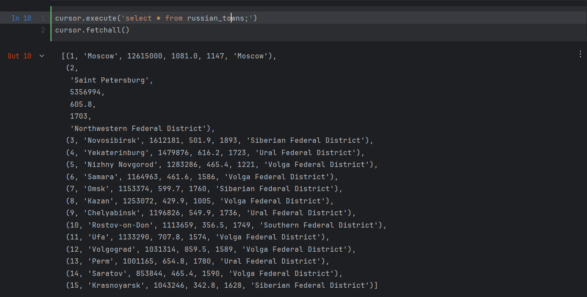
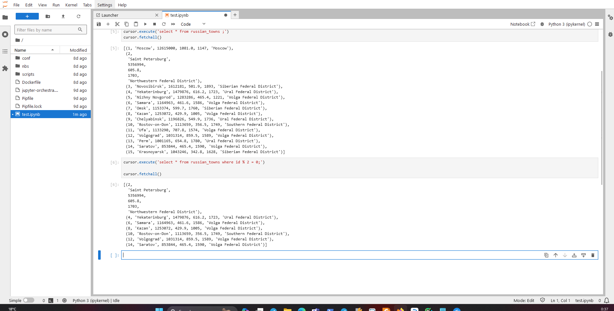

# Описание композ файла

В этом репозитории содержится файл docker-compose.yaml, который позволяет запустить три службы: Jupyter, PostgreSQL и pgAdmin.

**Jupyter**

* Служба Jupyter собирается из Dockerfile, расположенного в папке `./jupyter`.
* Доступна на порту 8888 и связана с папкой `./jupyter` на хост-машине.
* Зависит от службы PostgreSQL.

**PostgreSQL**

* Использует официальный образ PostgreSQL версии 14.
* Доступна на порту 5432.
* Хранит данные в объеме `db-data`.
* Использует следующие переменные окружения:
    * `POSTGRES_USER`: `postgres`
    * `POSTGRES_PASSWORD`: `postgres`
    * `POSTGRES_DB`: `postgres`

**pgAdmin**

* Использует официальный образ pgAdmin версии 4.
* Доступна на порту 80.
* Хранит данные в объеме `pgadmin-data`.
* Использует следующие переменные окружения:
    * `PGADMIN_DEFAULT_EMAIL`: `user@domain.com`
    * `PGADMIN_DEFAULT_PASSWORD`: `SecretPassword`

**Объемы**

* Используются два объёма для обеспечения постоянства данных: `db-data` и `pgadmin-data`.
* `db-data` хранит данные PostgreSQL.
* `pgadmin-data` хранит данные pgAdmin.

**Запуск**

1. Мы использовали команду:

```bash
docker-compose up -d
```

**Остановка**

1. Мы использовали команду:

```bash
docker-compose down
# CTRL-C
```

**Подключение к БД**

1. Из Jupyter мы использовали следующую строку подключения:

```python
import psycopg2
conn = psycopg2.connect(
    host="postgres", port=5432,
    dbname="postgres",
    user="postgres",
    password="postgres"
)
cursor = conn.cursor()
cursor.execute('select * from russian_towns;')
cursor.fetchall()
```
2. Results
- First

- Second


**Подключение к pgAdmin**

* Адрес: http://localhost
* Логин: user@domain.com
* Пароль: SecretPassword

## Файлы

- `docker-compose.yml`: Файл конфигурации Docker Compose.
- `.env`: Переменные окружения для сервисов.
- `answers.md`: Ответы на вопросы лабораторной работы.